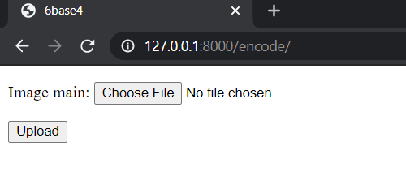
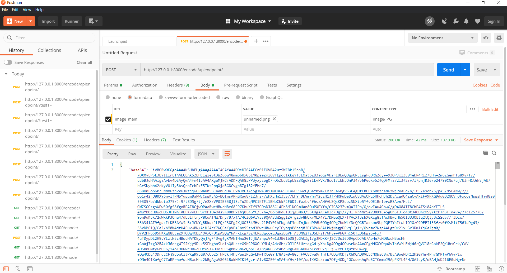

# BASE 64 - Image Encoder

#### Create Dev Env
```shell
// add this repository in git remote named as origin

git pull origin master
python -m venv venv
venv/Scripts/activate
(venv) pip install -r requirements.txt
python manage.py makemigration
python manage.py migrate
python manage.py runserver
```

#### Flow-diagram


The encoder service can either be used directly from UI or it can be utilized as an API Endpoint.

#### html UI



Click on upload, browse the image file and click upload
The UI will return the desired response

#### REST API Endpoint

the api can be be utilized using the endpoint:

```
<domain>:port/encode/apiendpoint/
```

Here's a sample API test completed successfully with postman


