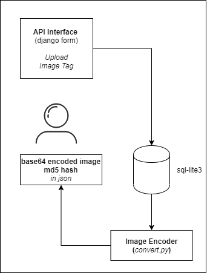

# BASE 64 - Image Encoder

#### Create Dev Env
```shell
// add this repository in git remote named as origin

git pull origin master
python -m venv venv
venv/Scripts/activate
(venv) pip install -r requirements.txt
```

#### Flow-diagram

